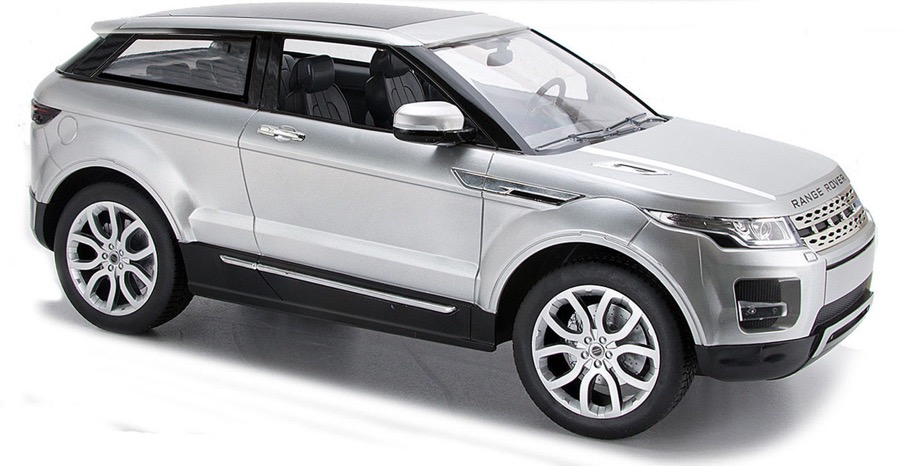
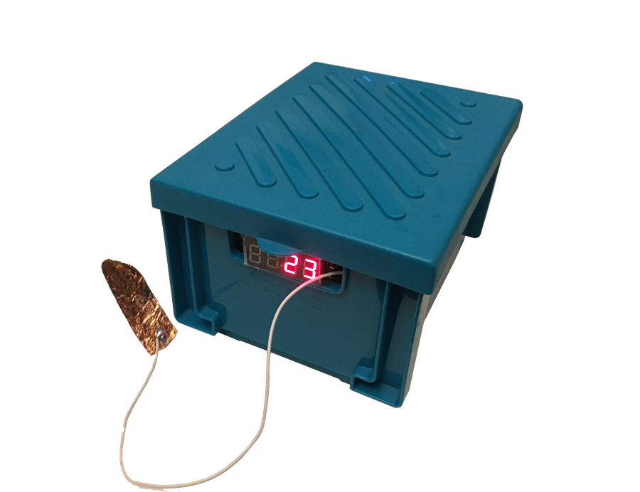
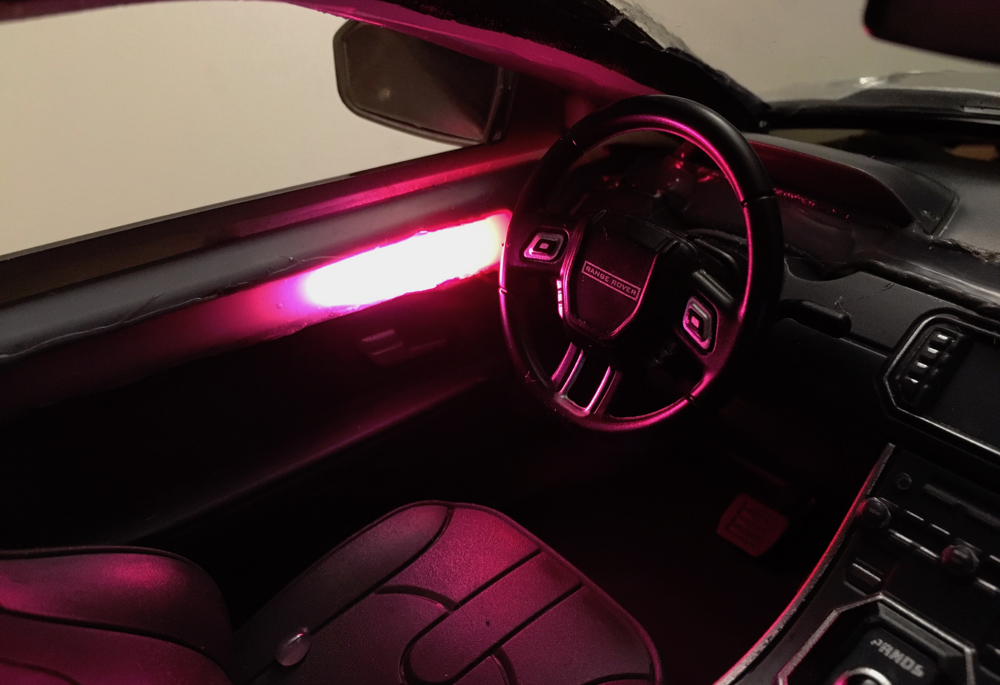
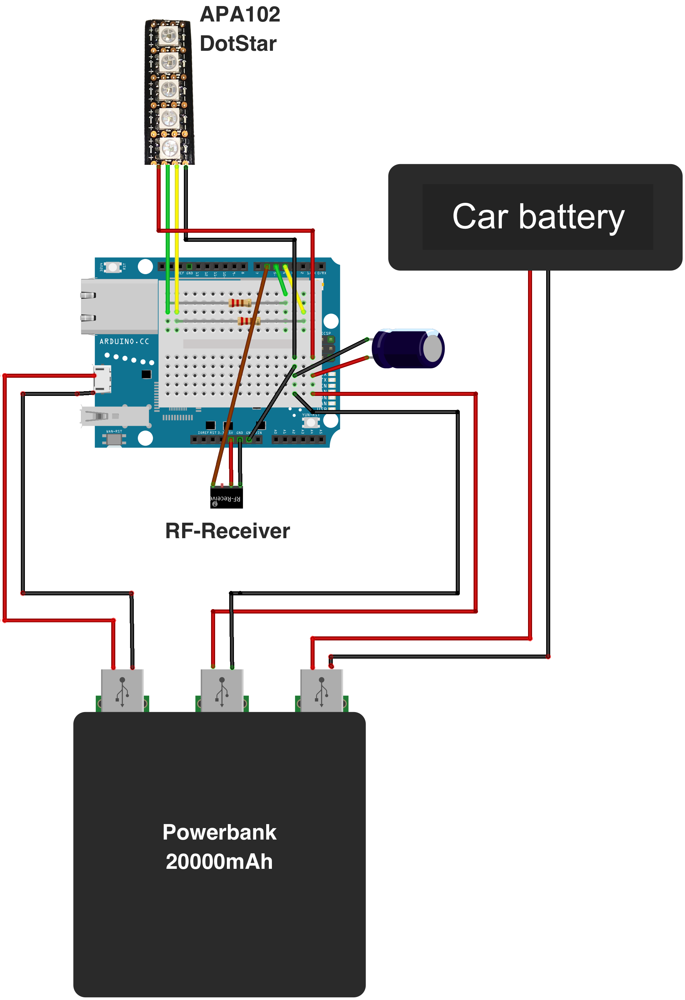
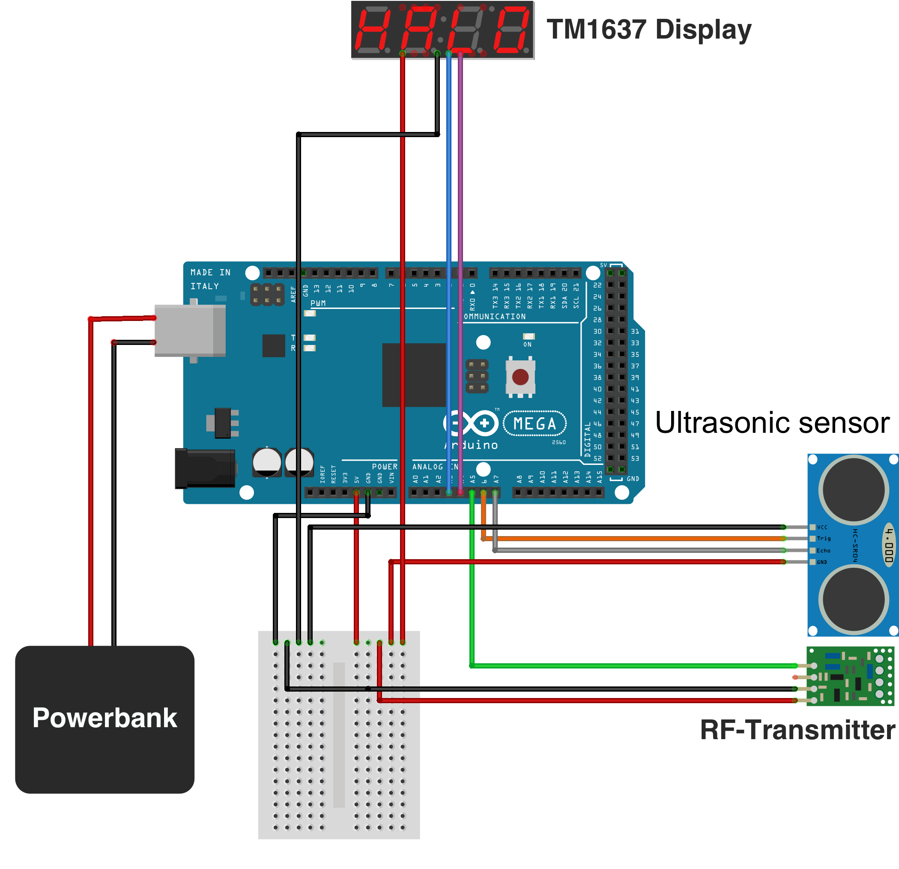

# SMALLCAR

The SMALLCAR (**S**caled **M**odel for **A**mbient **L**ight disp**L**ay **C**reation **A**nd **R**eview) is a scaled model car created to aid the design of in-vehicle ambient light patterns. These light patterns can be used to inform a driver of various traffic situations with a relatively low level of distraction. This repository contains the Arduino code created for this project.

## Hardware

<table>
  <tr>
    <td colspan="2"></td>
    <td colspan="2"></td>
  </tr>
  <tr>
    <td colspan="2"><b>
Hardware for model car
</b></td>
    <td colspan="2"><b>
Hardware for sensorbox
</b></td>
  </tr>
  <tr>
    <td>Model car</td>
    <td>Range Rover Evoque Model DX121030, 1:10</td>
    <td>Display</td>
    <td>TM1637 Segment Display</td>
  </tr>
  <tr>
    <td>Power supply</td>
    <td>EasyAcc Powerbank, 20000mAh</td>
    <td>Power supply</td>
    <td>5000mAh Powerbank</td>
  </tr>
  <tr>
    <td>Microcontroller</td>
    <td>Arduino Yún</td>
    <td>Microcontroller</td>
    <td>Arduino Uno</td>
  </tr>
  <tr>
    <td>Light displays</td>
    <td>Adafruit DotStar (APA102), 144 LED/m</td>
    <td>Distance sensor</td>
    <td>HC-SR04 Ultrasonic Distance Sensor</td>
  </tr>
  <tr>
    <td>RF-Receiver</td>
    <td>MX-05V, 433Mhz</td>
    <td>RF-Transmitter</td>
    <td>MX-FS-03V, 433Mhz</td>
  </tr>
  <tr>
    <td colspan="4"><b>
Required Arduino Libraries
</b></td>
  </tr>
  <tr>
    <td>FastLED</td>
    <td>Advanced methods for light displays</td>
    <td>NewPing</td>
    <td>Distance measuring methods for ultrasonic sensors</td>
  </tr>
  <tr>
    <td>VirtualWire</td>
    <td>Communication of two Arduinos via RF</td>
    <td>TM1637Display</td>
    <td>In order to display distance on display</td>
  </tr>
 </table>

## Additional images

## Wiring

